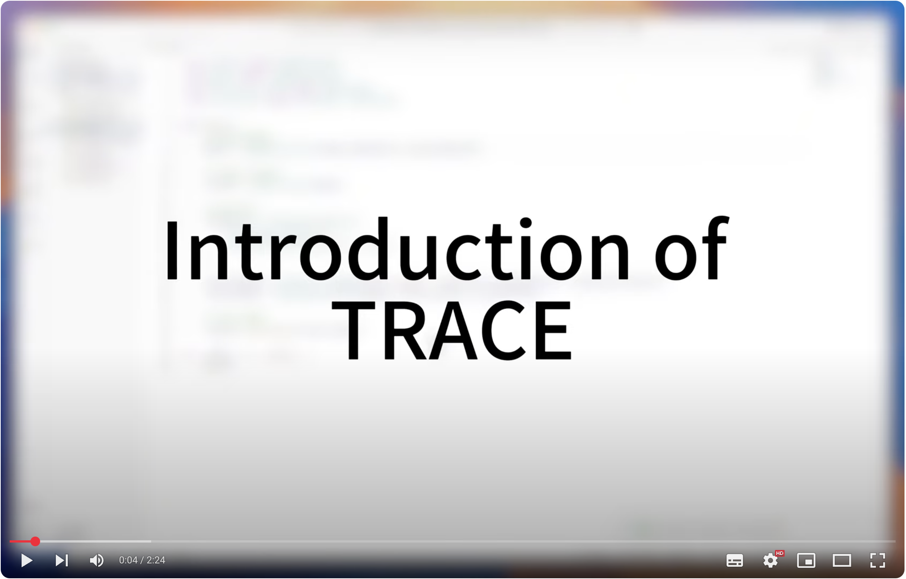

# ✍️ TRACE

TRACE is a Visual Studio Code extension that features automatic code edit recommendations.

# 📑 Content 
- [Demo](#-demo)
- [UI](#-ui)
- [Usage](#-usage)
- [Deployment](#-deployment)
- [Issues](#-issues)

## 🚀 Demo
> [!NOTE]
> Please click the image to watch the demo video on YouTube.

   

## ✨ UI

### Overview

### Diff View

## 🧑‍💻 Usage

## 🕹️ Deployments

## ❓ Issues

The project is still in development, not fully tested on different platforms. 

Welcome to propose issues or contribute to the code.

**😄 Enjoy coding!**
